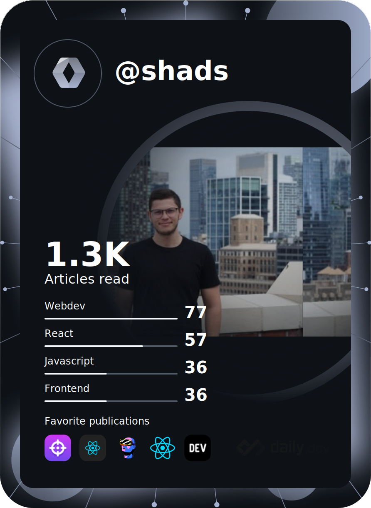

  
  <!---->

## Nice to meet you 

I'm Fabien, a french fullstack developer 🇫🇷. Tech lover & passionnate, I spend lot of time developping all kind of applications.

Gratuated at Epitech Nantes, I've spend 1 year studying in Bahrein 🎓.  

If you want to learn more about me, feel free to contact me 📬.

  
## My github stats 

  
  

  

  
  

## My daily dev stats

    

## Get in touch with some of my skills 

 

<!---->
